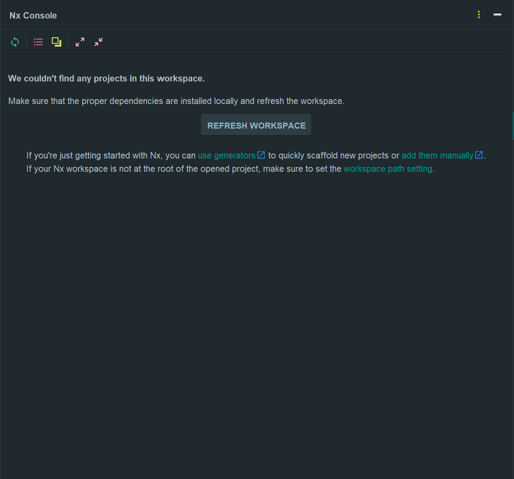
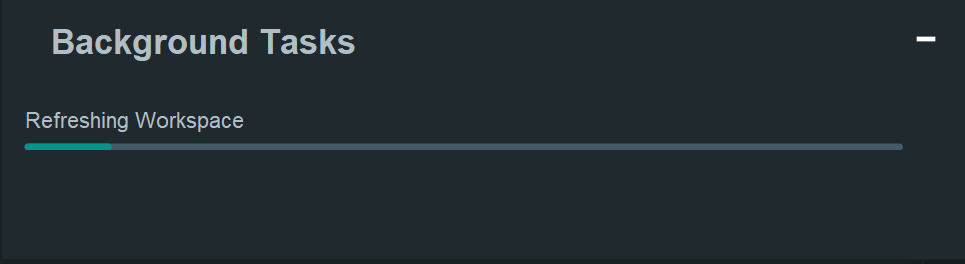

# NX BUG REPORT

Webstorm NX Console Plugin does not wokring in yarn pnp

## REPRODUCTION

1. clone git repository
    ```bash
   git clone https://github.com/ChoSeoHwan/nx-bug-report.git
   ```
   
2. yarn install
   ```bash
   yarn install
   ```

3. enable nx console plugin in webstorm


4. Click "REFRESH WORKSPACE" button
- stuck in loading




## Expected Behavior

Running the NX Console plugin with Yarn PnP without issues.
